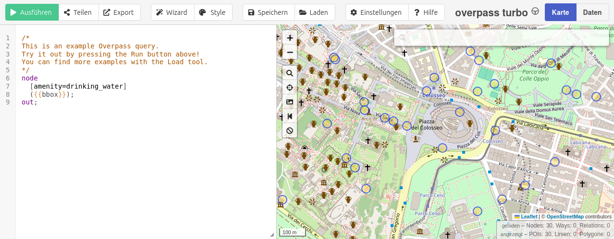

# Tutorial

Make sure you [have installed](index.md#Install) `Overpass.jl` before starting this guide.

```@setup overpass
using Overpass
```

## Get OpenStreetMap data
This package makes it easy to retrieve OpenStreetMap data using the [Overpass API](https://wiki.openstreetmap.org/wiki/Overpass_API) and its [query language](https://wiki.openstreetmap.org/wiki/Overpass_API/Overpass_QL).
Since the Overpass query language can be complex at times, this tutorial offers a simple workflow to help you create your queries more easily.

### Building queries with Overpass Turbo

[Overpass Turbo](https://overpass-turbo.eu/), with its graphical web interface, is a great tool for creating and testing queries.
Overpass.jl **supports custom Overpass Turbo queries**[^1], so there is no need to rewrite them.

After creating a query, it can be exported from Overpass Turbo by `Export > Query > Raw query`.


*Screenshot of Overpass Turbo*


### Get data using Overpass.jl

You can load your query directly from a file using `Overpass.query(<filename>)`.
This will read the query from the specified file and execute it.

```
/*
This is an example Overpass query.
Try it out by pressing the Run button above!
You can find more examples with the Load tool.
*/
node
  [amenity=drinking_water]
  ({{bbox}});
out;
```
*Content of `waterfountains.overpassql`*

```@example
using Overpass
Overpass.query("waterfountains.overpassql", bbox=(48.22, 16.36, 48.22, 16.36))
```

To keep the package small and flexible, the response is returned **as a string** instead of being parsed.
Depending on your needs, you can then parse the string, save it, or process it further.


## Debug and edit query in Overpass Turbo

Editing and debugging a raw Overpass query can be challenging.
To simplify the process, you can **generate a link** to your console that opens Overpass Turbo with your query.
In Overpass Turbo, you can then edit the query and download it again.

```@example overpass
@info Overpass.turbo_url("waterfountains.overpassql")
```

## Change Overpass endpoint

You can set a custom endpoint for the Overpass API.
The default endpoint is `https://overpass-api.de/api/`.
You can find a list of other endpoints in the [OpenStreetMap Wiki](https://wiki.openstreetmap.org/wiki/Overpass_API#Public_Overpass_API_instances).

!!! warning "Important"
    The endpoint URL must include a trailing slash

```julia
Overpass.set_endpoint("https://overpass.private.coffee/api/")
```

## Endpoint status

You can check the current status of the Overpass API endpoint to see if it's working properly.

```@example overpass
Overpass.status()
```

Status provides the following fields:

- connection_id::String
- server_time::DateTime
- endpoint::Union{Nothing, String}
- rate_limit::Int
- avalible_slots::Union{Nothing, Int}

## Supported Overpass Turbo shortcuts

These [Overpass Turbo shortcuts](https://wiki.openstreetmap.org/wiki/Overpass_turbo/Extended_Overpass_Turbo_Queries) are supported:

| Shortcut                 | Status            |
| ------------------------ | ----------------- |
| {{bbox}}                 | supported         |
| {{center}}               | supported         |
| {{date:*string*}}        | supported         |
| {{geocodeId:*name*}}     | not yet supported |
| {{geocodeArea:*name*}}   | not yet supported |
| {{geocodeBbox:*name*}}   | not yet supported |
| {{geocodeCoords:*name*}} | not yet supported |

[^1]: Full support of Overpass Turbo shortcut is still work in progress. See [list of supported shortcuts](tutorial.md#Supported-Overpass-Turbo-shortcuts)